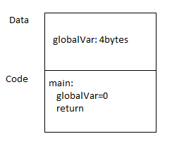

# C言語インターナル

* (原文: [C Internals](http://www.avabodh.com/cin/cin.html))

---

## はじめに

C言語は人気のあるプログラミング言語の一つで、多くの場合、システム・ソフトウェア関連のコードを記述する際に使用されます。
C言語はコンパイル型の言語です。
CコンパイラがC言語のコードをコンパイルし、CPU が直接実行することが可能な機械語命令を生成します。

C言語のコードをコンパイルする一般的な方法は、C言語のプログラムに対してコンパイラを実行するというものです。
コンパイラはアセンブリ言語のコードを生成し、アセンブラから CPU が実行できるコードが得られます。
C言語のコードからアセンブリ言語への「翻訳」は、ここで実行したコンパイラに依存します。
コンパイラが違えば「翻訳」方法も異なります。
但し、違いはそれほど多くはなく、全てのコンパイラが従うべき共通のパタンがあります。

本稿では、**i386プラットホームの ``gcc`` コンパイラ** を使用してC言語のコードがアセンブリ言語へどのように「翻訳」されるのかを解説します。
また C言語のほぼ全ての言語構造の「翻訳」についても説明します。

* 事前の知識：
C言語と少しだけアセンブリ言語

* アセンブリ言語の文法について：
本稿で使用するアセンブリ言語の文法は GNU アセンブラ（GAS）のものなので注意して下さい。
この文法は MASM や NASM のそれとは異なります。

    * 主な違いは次の通り：

        * NASM または MASM の場合
```
          命令 dest, src
```

        * GAS の場合
```
          命令 src, dest
```
    * 本稿を読む前に、読者は GNU アセンブラの文法に慣れ親しんでおく必要があります。

- 対象とする読者：
  - C言語のコードをアセンブリ言語に翻訳する方法に興味のある方
  - C言語とアセンブラでコードを記述するシステム・プログラマ
  - C言語で作成したバイナリのリバースエンジニアリングをしてみたいと考えている方

---

## プログラムの構造

簡単な C言語のプログラムの例を使って、実行時にプログラムがメモリの中にロードされた時の状態を見てみることにしましょう。

これが簡単な C言語のプログラムです：

```C
int globalVar;

void main()
{
        globalVar = 10;
}

```

このプログラムで注目したい点が二つあります。
それは「グローバル変数」と「関数」です。
関数には実行できるコードが含まれており、グローバル変数には何かデータが格納されています。
このプログラムが機械語に「翻訳」されてメモリにロードされる時、ランダム・アクセス・メモリ（RAM）の中には「データ（Data）」と「コード（Code）」を格納するための領域がそれぞれ確保されます。



「データ（Data）」の領域にはグローバル変数のために確保された数バイトの領域が含まれ、「コード（Code）」の領域は関数のコードから生成された命令をロードするために確保された数バイトの領域が含まれます。
CPU がこれらの命令を実行し、データを処理します。

次に、このプログラム用に生成した実際のアセンブリ言語のコードを見てみることにしましょう：

```Unix Assembly
        .comm   globalVar,4,4
        .text
.globl main
        .type   main, @function
main:
        pushl   %ebp
        movl    %esp, %ebp
        movl    $10, globalVar
        popl    %ebp
        ret
```

このコードにコメントを入れたものが、こちらです：

```Unix Assembly
# これがグローバル変数の宣言
# .comm は初期化していないデータを宣言するための識別子
# アセンブラは .bss セグメントの中に、ここに示したサイズの領域を確保する
        .comm   globalVar,4,4
# .text セグメントは、ここから始まる
        .text
# main という関数名を公開することで、このファイルの外から main 関数を呼び出すことができる
.globl main
        .type   main, @function
# 生成した main 関数のコード
main:
        pushl   %ebp
        movl    %esp, %ebp
        movl    $10, globalVar
        popl    %ebp
        ret
```

### セクションとセグメント

「セクション」は、プログラムのリンク時に必要となる情報を格納したオブジェクト・ファイルの中にある領域を示します。
セクションには、リンカが実行形式のバイナリを生成するために使用するデータが含まれています。
例えば、あるセクションにはプログラムのコードやグローバル変数、再配置テーブルなどを格納することができます。
そして「セグメント」はセクションに似ていますが、これが実際にプログラムを実行する際にメモリに格納される領域です。
実行可能なバイナリにはたくさんのセグメントが含まれており、それらはプログラムを実行する時にローダによってメモリにロードされます。
セクションとセグメントには ``.text`` とか ``.data`` とか ``.bss`` といった名前が付いています。

ここに、C言語のコードからアセンブリ言語のコードを生成する場面でよく使用するセクションやセグメントを例として上げてみました：
* ``.text`` => ここには実行可能な命令が格納される。
* ``.bss`` => ここには初期化されていない（全てのビットが0にセットされている）データが格納される。通常は、初期化されていないスタティック変数とグローバル変数が格納される。プログラムからこのセクションにデータを書き込むことができる。
* ``.data`` => ここには初期化されたグローバル変数が格納される。例えば ``int x = 20;`` とグローバル宣言するとここに格納される。プログラムからこのセクションにデータを書き込むことができる。

``.bss`` と ``.data`` セクションはほぼ同じです。
唯一の違いはプログラムがロードされた時に確保したメモリの初期値です。
``.bss`` セグメントは全てのビットが 0 であり、``.data`` セグメントは C言語のコードで宣言されていた値です。

* ``.rodata`` => ここには読み込み専用のデータが格納される。このセグメントは、プログラムがロードされた時にメモリにロードされ、プログラムからは変更することができない領域である。通常、これは文字列の定数が格納される。

オブジェクト・ファイルや実行可能なファイルには他にもいろいろなセクションが存在しますが、それらの多くはプログラムの実行時にメモリにはロードされません。
例えば ``.debug`` セグメントにはデバッガが必要とする情報しか格納されていません。
また、いくつかのセクションはオブジェクト・モジュールにしか存在せず、あとで別のセクションと結合されるというものもあります。
そのようなものには、例えば ``.common`` セクションがあります。

---

## スタックとローカル変数

再び、この簡単な C言語のプログラムから始めることにしましょう：

```C
int globalVar;

void main()
{
        globalVar = 10;
}

```

このプログラムにはグローバル変数が一つあります。
これまで見てきたように、グローバル変数は ``.data`` セグメントの中に確保されます。
それじゃあローカル変数はどうでしょうか？
ローカル変数は「スタック」の中に確保されます。
ひとたび関数の処理が終了してしまえば、ローカル変数は解放されてしまいます。

スタックを持つプログラム構造は、このように見えます：


「スタック」は、プログラム内のスタック領域に割当てられているメモリのことで、領域を確保する度にその境界線がアドレスの高位から低位へ向かって伸びていきます。
では別のサンプル・コードでスタックがどのように使用されるかを見てみることにしましょう。

```C
void fun()
{
	int locVar = 0;
	locVar++;
}
```
このプログラムは、次のスタック操作に似たコードに変換されます：

```
fun:
  stack_top -= 4
  stack_top[0] = 0
  stack_top[0] ++
  stack_top += 4
  return
```

まず関数を処理する前、スタックの境界線を示す ``stack_top`` はスタックの先頭を指していました。
関数の先頭で ``stack_top`` は -4バイトされ（4バイト分だけ低位へ向かって進み）、これによって事実上確保された 4バイトの領域がローカル変数の ``locVar`` によって使用されることになります。
そして関数から ``return`` する直前で、再び ``stack_top`` は関数を処理する前の位置を指すようになります。
このサンプル・コードにはローカル変数は一つだけしかありません。
もしローカル変数がもっとたくさんあったとしたら、``stack_top`` はその変数分だけ減らされることで、全てのローカル変数が融通されるようになります。

**注記：**
ここで実際に減らされるバイト数は要求されたものよりも大きくなるかもしれません（全てのローカル変数が要求したメモリ領域の合計になるので）。
これは、次に示す二つの理由の可能性があります：

 1. アーキテクチャの制限
 2. 一部のアーキテクチャでは高速化のためにコードを最適化するものがある（``stack_top`` が16バイト単位で移動する等）

次に、``gcc`` が生成した実際のアセンブリ言語のコードを見てみることにしましょう：

```Unix Assembly
fun:
	pushl	%ebp
	movl	%esp, %ebp
	subl	$16, %esp
	movl	$0, -4(%ebp)
	addl	$1, -4(%ebp)
	leave
	ret
```

生成したアセンブリ言語のコードにコメントを入れたものが、こちらです：

```Unix Assembly
# fun 関数の先頭
fun:

# 現在の ebp レジスタの値を push する（実際には ebp レジスタの値をスタックに「退避」する）。
# この「退避」は、あとで ebp レジスタの値を変更するために実施する。
# この関数が終了したら、スタックから ebp レジスタの値をリストアする。
# これにより、関数の最後に到達した時点で ebp レジスタの値は元の値に戻る。
	pushl	%ebp

# ここで現在のスタック・ポインタの値を ebp レジスタに移動する。
	movl	%esp, %ebp

# 現在のスタック・ポインタの値を減らす。
# この操作によって確保された領域が、この関数内で宣言されたローカル変数のために使用される。
# 
# このサンプル・コードではローカル変数は一つだけなので、普通ならば 4バイトで十分なのに、スタックは 16バイト減らされている。
# 前にも述べたように、パフォーマンス上の理由などで esp レジスタの値を 16バイト単位で移動させている。
# それ以外の領域は、この関数を処理している間は使用されない。
# 
# ここで 4バイトのサイズのローカル変数が二つあると仮定すると、同じ理由で esp レジスタの値がそれぞれ 16バイトずつ減っていくことになるが
# その分だけ未使用の領域は少なくなる。
	subl	$16, %esp

# '-4(%ebp)' はローカル変数 locVar の値が格納されているメモリの場所なので、これに 0 をセットする。
	movl	$0, -4(%ebp)

# ローカル変数の locVar の値をインクリメントする。
	addl	$1, -4(%ebp)

# ここで ebp レジスタの値をスタックからリストアして、この関数の呼出元に返る。
#   'leave' 命令は次の二つの命令を行う：
#      move %ebp %esp
#      pop %ebp
	leave
	ret
```

ここにあるスタックの図は上のコードを説明するものです：


**課題：**
同様に、次の状態を説明するスタックの図を書いてみましょう
「もし関数からローカル変数のポインタが返されたら何が起こるか？」

---

## 算術演算の翻訳

どのように計算式がアセンブリ言語のコードに「翻訳」されるのかを見ていくことにしましょう。
この C言語のコードを例にとります：

```C
        int a = 2;
        int b = 3;
        int c = 24;
        a = a + b;
        aa = a + b * c;
```

これが生成したアセンブリ言語のコードです：

```Unix Assembly
	movl	$2, -4(%ebp)
	movl	$3, -8(%ebp)
	movl	$24, -12(%ebp)
	movl	-8(%ebp), %eax
	addl	%eax, -4(%ebp)
	movl	-8(%ebp), %eax
	imull	-12(%ebp), %eax
	addl	%eax, -4(%ebp)
```

スタックにおけるローカル変数の位置はそれぞれ次のとおりです（ローカル変数については[ここ](/ch03-01-stack-and-local-variables.md)で説明しました）：

```
    a => ebp - 4 => -4 (%ebp)
    b => ebp - 8 => -8 (%ebp)
    c => ebp - 12 => -12 (%ebp)
```

生成したアセンブリ言語のコードにコメントを入れたものが、こちらです：

```Unix Assembly
# a = 2
	movl	$2, -4(%ebp)
# b = 3
	movl	$3, -8(%ebp)
# c = 24
	movl	$24, -12(%ebp)
# tmp = b
movl	-8(%ebp), %eax

（つづく）
```

i386 アーキテクチャには一つの命令に対して指定できるメモリ・アドレスの数に制限があります。
一個の命令で任意の数のメモリ・アドレスを使用することはできません。
そのため一時的な格納場所としてレジスタを使用します。
複数のレジスタを使って数値演算やその他の演算を行います。
レジスタの一般的な使い方は、最初にメモリの内容をレジスタに取り込み、レジスタ同士で何か操作してから、レジスタの値をメモリに格納するというものです。
次のサンプルでは、``eax`` レジスタを一時的な保管場所として使用しています。
上のコメントでは ``tmp`` が ``eax`` レジスタを表します。


```Unix Assembly
(つづき）

# a = a + tmp
	addl	%eax, -4(%ebp)
# tmp = b
	movl	-8(%ebp), %eax
# tmp = tmp * c
	imull	-12(%ebp), %eax
# a = tmp + a
	addl	%eax, -4(%ebp)
```

**課題：**
算術式に"（）"が含まれている場合、どのようにアセンブリ言語のコードに翻訳されるのか？

---

## ビット演算の翻訳

この C言語のコードを例にとります。これは何かの関数の中から抜粋したコードです：

```C
        int a = 4;
        int b = 8;
        int c = a | b;
        int d = b & c;
```

スタックにおけるローカル変数の位置はそれぞれ次のとおりです（ローカル変数については[ここ](/ch03-01-stack-and-local-variables.md)で説明しました）：

```
    a => -4 (%ebp)
    b => -8 (%ebp)
    c => -12 (%ebp)
    d => -16 (%ebp)
```

一時的な保管場所としてのレジスタの使い方については[ここ](/ch04-01-translation-of-arithmetic-operations.md#tempVaribaleUsage)で説明しました。

これが生成したアセンブリ言語のコードです：

```Unix Assembly
	movl	$4, -4(%ebp)
	movl	$8, -8(%ebp)
	movl	-8(%ebp), %eax
	movl	-4(%ebp), %edx
	orl	%edx, %eax
	movl	%eax, -12(%ebp)
	movl	-12(%ebp), %eax
	movl	-8(%ebp), %edx
	andl	%edx, %eax
	movl	%eax, -16(%ebp)
```

生成したアセンブリ言語のコードにコメントを入れたものが、こちらです：

```Unix Assembly
# a = 4
	movl	$4, -4(%ebp)

# b = 8
	movl	$8, -8(%ebp)

# tmp = b
	movl	-8(%ebp), %eax

# tmp2 = a
	movl	-4(%ebp), %edx

# tmp = tmp | tmp2
	orl	%edx, %eax

# c = tmp
	movl	%eax, -12(%ebp)

# tmp = c
	movl	-12(%ebp), %eax

# tmp2 = b
	movl	-8(%ebp), %edx

# tmp = tmp & tmp2
	andl	%edx, %eax

# d = tmp
	movl	%eax, -16(%ebp)
```

（ローカル）変数の中身がそれぞれレジスタに移動され、ビット演算の命令（このサンプルの場合だと ``andl`` と ``olr``）を使用したあと、その結果をメモリに戻しています。

---

## 分岐処理の翻訳

#### <u>IF-ELSE 文</u>

この C言語のコードを例にとります。これは何かの関数の中から抜粋したコードです：

```C
	int a = 4;
	int b = 8;
	int d = 0;

	if (a > b) {
		d = 1;
	}
	else {
		d = 2;
	}
```

そして生成したアセンブリ言語のコードが、こちら：

```Unix Assembly
	movl	$4, -4(%ebp)
	movl	$8, -8(%ebp)
	movl	$0, -12(%ebp)
	movl	-4(%ebp), %eax
	cmpl	-8(%ebp), %eax
	jle	.L2
	movl	$1, -12(%ebp)
	jmp	.L1
.L2:
	movl	$2, -12(%ebp)
.L1:
```

スタックにおけるローカル変数の位置はそれぞれ次のとおりです（ローカル変数については[ここ](/ch03-01-stack-and-local-variables.md)で説明しました）：

```
    a => -4 (%ebp)
    b => -8 (%ebp)
    d => -12 (%ebp)
```

一時的な保管場所としてのレジスタの使い方については[ここ](/ch04-01-translation-of-arithmetic-operations.md#tempVaribaleUsage)で説明しました。

生成したアセンブリ言語のコードにコメントを入れたものが、こちらです：

```Unix Assembly
# a = 4
	movl	$4, -4(%ebp)

# b = 8
	movl	$8, -8(%ebp)

# d = 0
	movl	$0, -12(%ebp)

# tmp = a
	movl	-4(%ebp), %eax

# b と tmp (a) を比較する
	cmpl	-8(%ebp), %eax

# もし tmp (a) が b よりも小さいかまたは等しい場合は
# ラベル L2 （C言語のコードで言うと else ブロック）へジャンプする
	jle	.L2

# ここから if ブロック
# d = 1
	movl	$1, -12(%ebp)

# ここが if ブロックの最後の命令
# else ブロックの先にある命令（ラベル L1）へジャンプする
	jmp	.L1

# ここから else ブロック（ラベル L2）
.L2:

# d = 2
	movl	$2, -12(%ebp)

# ここで else ブロックは終了
# ここが else ブロック直後の命令
.L1:
```

#### <u>SWITCH-CASE 文</u>

この C言語のコードを例にとります。これは何かの関数の中から抜粋したコードです：

```C
	int a = 4;
	int b = 8;
	int d = 0;

	switch (b) {
	case 2:
		a++;
		break;
	case 8:
		b++;
		break;
	default:
		d++;
		break;
	}
```

そして生成したアセンブリ言語のコードが、こちら：

```Unix Assembly
	movl	$4, -4(%ebp)
	movl	$8, -8(%ebp)
	movl	$0, -12(%ebp)
	movl	-8(%ebp), %eax
	cmpl	$2, %eax
	je	.L3
	cmpl	$8, %eax
	je	.L4
	jmp	.L6
.L3:
	addl	$1, -4(%ebp)
	jmp	.L1
.L4:
	addl	$1, -8(%ebp)
	jmp	.L1
.L6:
	addl	$1, -12(%ebp)
.L1:
```

スタックにおけるローカル変数の位置はそれぞれ次のとおりです（ローカル変数については[ここ](/ch03-01-stack-and-local-variables.md)で説明しました）：

```
    a => -4 (%ebp)
    b => -8 (%ebp)
    d => -12 (%ebp)
```

一時的な保管場所としてのレジスタの使い方については[ここ](/ch04-01-translation-of-arithmetic-operations.md#tempVaribaleUsage)で説明しました。

生成したアセンブリ言語のコードにコメントを入れたものが、こちらです：

```Unix Assembly
# a = 4
# b = 8
# d = 0
	movl	$4, -4(%ebp)
	movl	$8, -8(%ebp)
	movl	$0, -12(%ebp)

# tmp = b
	movl	-8(%ebp), %eax

# tmp と '2' を比較する
	cmpl	$2, %eax

# この比較が成功したらラベル L3 へジャンプする
# (ラベル L3 が switch ブロックの一番目の case ブロック)
	je	.L3

# tmp と '8' を比較する
	cmpl	$8, %eax

# この比較が成功したらラベル L4 へジャンプする
# (ラベル L4 が switch ブロックの二番目の case ブロック)
	je	.L4

# ここは default ブロック
# default ケースのコード（ラベル L6） へジャンプする
	jmp	.L6

# ここが一番目の case ブロックのコード
# a = a + 1
.L3:
	addl	$1, -4(%ebp)
	jmp	.L1

# ここが二番目の case ブロックのコード
# b = b + 1
.L4:
	addl	$1, -8(%ebp)
	jmp	.L1

# ここで default ブロックのコード
# d = d + 1
.L6:
	addl	$1, -12(%ebp)

# switch-case ブロック直後のラベル
.L1:
```

``default`` を除く 各 ``case`` ブロックの最後には switch-case ブロック直後のラベルへジャンプする命令があります。
このジャンプ命令が生成される理由は、C言語のコードの ``case`` ブロックの最後に ``break`` 文を書いたからです。
もし ``break`` 文を書かなかったら、このジャンプ命令は生成されず、次の case ブロックにあるコードが実行されるようになります。
この動きは C言語の仕様に準拠したものです。

---

## ループ処理の翻訳

#### <u>WHILE ループ</u>

この C言語のコードを例にとります。これは何かの関数の中から抜粋したコードです：

```C
	int a = 4;
	int b = 8;
	int d = 0;

	while (b > a) {
		d = a + 2;
		b--;
	}
```

これが生成したアセンブリ言語のコードです：

```Unix Assembly
	movl	$4, -4(%ebp)
	movl	$8, -8(%ebp)
	movl	$0, -12(%ebp)
	jmp	.L2
.L3:
	movl	-4(%ebp), %eax
	addl	$2, %eax
	movl	%eax, -12(%ebp)
	subl	$1, -8(%ebp)
.L2:
	movl	-8(%ebp), %eax
	cmpl	-4(%ebp), %eax
	jg	.L3
```

スタックにおけるローカル変数の位置はそれぞれ次のとおりです（ローカル変数については[ここ](/ch03-01-stack-and-local-variables.md)で説明しました）：

```
    a => -4 (%ebp)
    b => -8 (%ebp)
    d => -12 (%ebp)
```

一時的な保管場所としてのレジスタの使い方については[ここ](/ch04-01-translation-of-arithmetic-operations.md#tempVaribaleUsage)で説明しました。

生成したアセンブリ言語のコードにコメントを入れたものが、こちらです：


```Unix Assembly
#
#
#
	movl	$4, -4(%ebp)
	movl	$8, -8(%ebp)
	movl	$0, -12(%ebp)

#
	jmp	.L2

#
.L3:

#
	movl	-4(%ebp), %eax
#
	addl	$2, %eax

#
	movl	%eax, -12(%ebp)

#
	subl	$1, -8(%ebp)

#
.L2:

#
	movl	-8(%ebp), %eax

#
	cmpl	-4(%ebp), %eax
#
	jg	.L3
```
