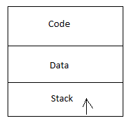
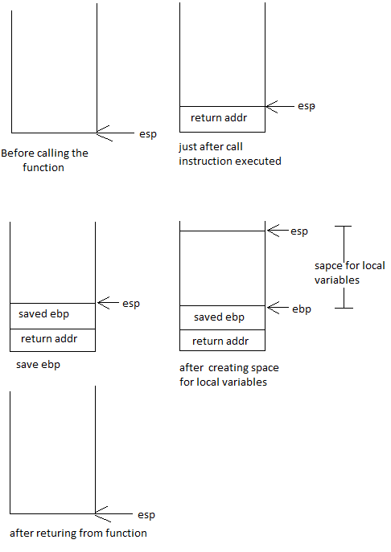

## スタックとローカル変数

再び、この簡単な C言語のプログラムから始めることにしましょう：

```C
int globalVar;

void main()
{
        globalVar = 10;
}

```

このプログラムにはグローバル変数が一つあります。
これまで見てきたように、グローバル変数は ``.data`` セグメントの中に確保されます。
それじゃあローカル変数はどうでしょうか？
ローカル変数は「スタック」の中に確保されます。
ひとたび関数の処理が終了してしまえば、ローカル変数は解放されてしまいます。

スタックを持つプログラム構造は、このように見えます：



「スタック」は、プログラム内のスタック領域に割当てられているメモリのことで、領域を確保する度にその境界線がアドレスの高位から低位へ向かって伸びていきます。
では別のサンプル・コードでスタックがどのように使用されるかを見てみることにしましょう。

```C
void fun()
{
	int locVar = 0;
	locVar++;
}
```
このプログラムは、次のスタック操作に似たコードに変換されます：

```
fun:
  stack_top -= 4
  stack_top[0] = 0
  stack_top[0] ++
  stack_top += 4
  return
```

まず関数を処理する前、スタックの境界線を示す ``stack_top`` はスタックの先頭を指していました。
関数の先頭で ``stack_top`` は -4バイトされ（4バイト分だけ低位へ向かって進み）、これによって事実上確保された 4バイトの領域がローカル変数の ``locVar`` によって使用されることになります。
そして関数から ``return`` する直前で、再び ``stack_top`` は関数を処理する前の位置を指すようになります。
このサンプル・コードにはローカル変数は一つだけしかありません。
もしローカル変数がもっとたくさんあったとしたら、``stack_top`` はその変数分だけ減らされることで、全てのローカル変数が融通されるようになります。

**注記：**
ここで実際に減らされるバイト数は要求されたものよりも大きくなるかもしれません（全てのローカル変数が要求したメモリ領域の合計になるので）。
これは、次に示す二つの理由の可能性があります：

 1. アーキテクチャの制限
 2. 一部のアーキテクチャでは高速化のためにコードを最適化するものがある（``stack_top`` が16バイト単位で移動する等）

次に、``gcc`` が生成した実際のアセンブリ言語のコードを見てみることにしましょう：

```asm
fun:
	pushl	%ebp
	movl	%esp, %ebp
	subl	$16, %esp
	movl	$0, -4(%ebp)
	addl	$1, -4(%ebp)
	leave
	ret
```

生成したアセンブリ言語のコードにコメントを入れたものが、こちらです：

```asm
# fun 関数の先頭
fun:

# 現在の ebp レジスタの値を push する（実際には ebp レジスタの値をスタックに「退避」する）。
# この「退避」は、あとで ebp レジスタの値を変更するために実施する。
# この関数が終了したら、スタックから ebp レジスタの値をリストアする。
# これにより、関数の最後に到達した時点で ebp レジスタの値は元の値に戻る。
	pushl	%ebp

# ここで現在のスタック・ポインタの値を ebp レジスタに移動する。
	movl	%esp, %ebp

# 現在のスタック・ポインタの値を減らす。
# この操作によって確保された領域が、この関数内で宣言されたローカル変数のために使用される。
# 
# このサンプル・コードではローカル変数は一つだけなので、普通ならば 4バイトで十分なのに、スタックは 16バイト減らされている。
# 前にも述べたように、パフォーマンス上の理由などで esp レジスタの値を 16バイト単位で移動させている。
# それ以外の領域は、この関数を処理している間は使用されない。
# 
# ここで 4バイトのサイズのローカル変数が二つあると仮定すると、同じ理由で esp レジスタの値がそれぞれ 16バイトずつ減っていくことになるが
# その分だけ未使用の領域は少なくなる。
	subl	$16, %esp

# '-4(%ebp)' はローカル変数 locVar の値が格納されているメモリの場所なので、これに 0 をセットする。
	movl	$0, -4(%ebp)

# ローカル変数の locVar の値をインクリメントする。
	addl	$1, -4(%ebp)

# ここで ebp レジスタの値をスタックからリストアして、この関数の呼出元に返る。
#   'leave' 命令は次の二つの命令を行う：
#      move %ebp %esp
#      pop %ebp
	leave
	ret
```

ここにあるスタックの図は上のコードを説明するものです：





**課題：**
同様に、次の状態を説明するスタックの図を書いてみましょう
「もし関数からローカル変数のポインタが返されたら何が起こるか？」

---

* [目次](/SUMMARY.md)

* [前へ](/ch02-01-program-structure.md)

* [次へ](/ch04-01-translation-of-arithmetic-operations.md)
