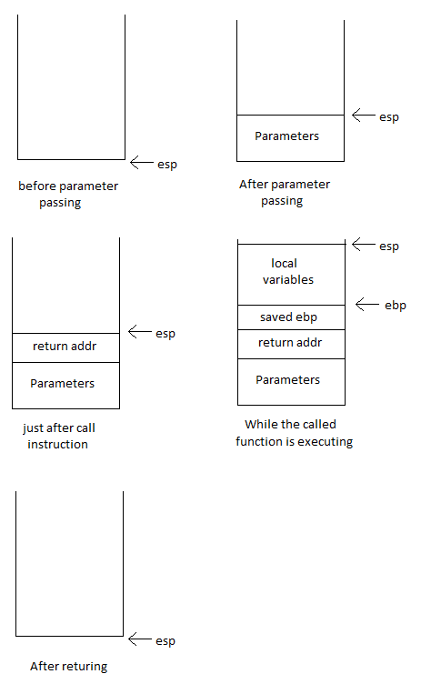

## 引数渡しの処理

C言語の「引数」はスタックに渡されます。
関数の引数がスタックに Push されてから関数が呼び出されます。
これにより Push した引数はスタックの中で「戻り先のアドレス」の真下に格納されます。
したがって関数が引数を受け取る場合、スタックの中で「戻り先のアドレス」の真下から順番に読んでいけばよいことになります。

C言語のコード：

```C
void fun(int x, int y)
{
	x++;
	x += y;
}

void main(void)
{
	fun(2, 3);
}
```

これが生成したアセンブリ言語のコードです：

```asm
	.text
	.globl	fun
fun:
	pushl	%ebp
	movl	%esp, %ebp
	addl	$1, 8(%ebp)
	movl	12(%ebp), %eax
	addl	%eax, 8(%ebp)
	popl	%ebp
	ret
	.globl	main
main:
	pushl	%ebp
	movl	%esp, %ebp
	subl	$8, %esp
	movl	$3, 4(%esp)
	movl	$2, (%esp)
	call	fun
	leave
	ret
```

スタックにおけるローカル変数の位置はそれぞれ次のとおりです（ローカル変数については[ここ](/ch03-01-stack-and-local-variables.md#スタックとローカル変数)で説明しました）：

```
    x => (ebp -  8) => -8(%ebp)
    y => (ebp - 12) => -12(%ebp), %eax
```

これは「[スタックとローカル変数](/ch03-01-stack-and-local-variables.md#スタックとローカル変数)」の章で説明した内容と非常に関連があります。
引数はローカル変数として確保されます。
ただ一つ異なる点は、関数への引数を格納し、その上に「戻り先のアドレス」を Push したスタックの TOP（最上位）にローカル変数が確保されるということです。

引数渡しのスタック操作は、次の図を使って説明できます：



生成したアセンブリ言語のコードにコメントを入れたものが、こちらです：

```asm
# ここが .text セグメントの先頭
	.text

# fun 関数を外部へエキスポートする
	.globl	fun

# fun 関数の先頭
fun:

# ebp レジスタの内容をスタックに退避する
	pushl	%ebp
	movl	%esp, %ebp

# x++;
	addl	$1, 8(%ebp)

# tmp = y
	movl	12(%ebp), %eax

# tmp = tmp + x
	addl	%eax, 8(%ebp)

# ebp レジスタの内容を復帰する
	popl	%ebp
	ret

# main 関数を外部へエキスポートする
	.globl	main

# main 関数の先頭
main:
# ebp レジスタの内容をスタックに退避する
	pushl	%ebp
	movl	%esp, %ebp

# スタックポインタ =- 8
	subl	$8, %esp

# 二番目の引数をスタックに格納する
	movl	$3, 4(%esp)

# 一番目の引数をスタックに格納する
	movl	$2, (%esp)

# fun 関数を呼び出す
	call	fun

# main 関数から戻る
	leave
	ret
```

理解すべきポイント：

* 言語の関数の引数は左から右の順に渡される。
最後の引数が最初にスタックに格納され、先頭の引数が最後に格納される。
そのためスタックを TOP（最上位）から参照していくと一番先頭の引数がまず最初に見つかる。

* C言語から生成されたアセンブリ言語のコードでは引数をスタックに格納する際に ``push`` 命令を使っていない。
その代わり、まずスタックポインタの位置を下位にずらし、そこで空いた領域に引数を ``movl`` 命令で格納している。
おそらくパフォーマンスの理由でこのような操作になっていると思われる
（``subl`` ＋ ``movl`` 命令の組み合わせは ``push`` 命令よりも高速なのだろう）。

* もし引数の型が構造体だったら、構造体全体がスタックに格納される。

---

* [目次](/SUMMARY.md#C言語インターナル)

* [前へ](/ch11-01-function-call.md#関数の呼び出し)

* [次へ](/ch13-01-returning-value-from-function.md#関数の返り値)
